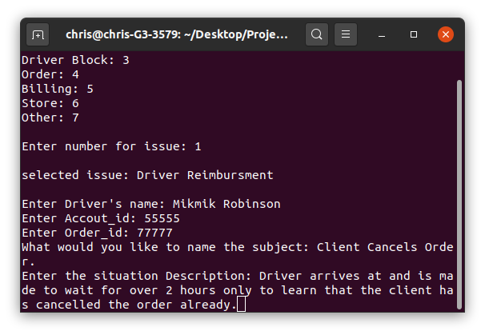

# Ticket Maker: Productivity Tool for Creating Tickets for Chat Support

# About

I started working my job @PointPickup November 23 2020.

During my first day I noticed I was having a problem with how to speedily saving from my chats for my tickets while managing my chats at the same time.

So like any **true problem solving software engineer** I had to do something about it!

During my second day **2 hours** before I started my second shift i started this project and I was able to comeplete the ticket creator portion of the program.

During the third day I emplemented the program into my shift and I was able to lower the time it took me too write down tickets from **1 hour to 15 minutes**.

After my third shift I made the display part of the program and completed version 1 and now we're here!
&nbsp;
&nbsp;

# The Two Parts Of This Project

### The Ticket Creator

Personalizes the ticket you create to the issue.

This program can deal with many issues: 
Driver Reimbursment, Bug report, Driver Block, Order, Store, and more!

### The Ticket Displayer

Displays the created tickets in a preview so you'll know exactly how to make your ticket!

&nbsp;
&nbsp;

# How To Use

For now you can only use this in your terminal!

1. Clone the repo

2. Make the file executable

3. And then you're all set!

### Author
Christian Williams